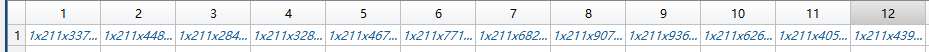

# gpt_killer

## Proposal
- papers given document description

### intoduction

### methodology

WAN 工作原理

简单的说，WAN 是把文本转换成了网络。

对于每一个作者，都会有一个网络

classification原理：对于一个未知文本，首先计算WAN，与已知作者比较，找出最相似的那个

## Questions field

数据维度不统一，如何处理？

224 function words

but for data only 211

need to construct WAN for chatgpt, but unknown data. only given network.

